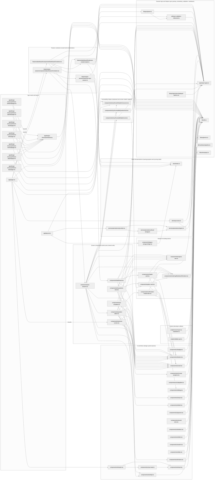

```mermaid
%%{init: {"theme":"neutral"}}%%
flowchart LR
%% generated_date: "2025-12-21"

subgraph app_layer["App routes and layout"]
  app_layout_tsx["app/layout.tsx"]
  app_page_tsx["app/page.tsx"]

  app_design_showcase_shared_tsx["app/design-showcase/shared.tsx"]
  app_design_showcase_theme_ankidroid_page_tsx["app/design-showcase/theme-ankidroid/page.tsx"]
  app_design_showcase_theme_aptitude_page_tsx["app/design-showcase/theme-aptitude/page.tsx"]
  app_design_showcase_theme_brand_page_tsx["app/design-showcase/theme-brand/page.tsx"]
  app_design_showcase_theme_dark_page_tsx["app/design-showcase/theme-dark/page.tsx"]
  app_design_showcase_theme_minimal_page_tsx["app/design-showcase/theme-minimal/page.tsx"]
  app_design_showcase_theme_playful_page_tsx["app/design-showcase/theme-playful/page.tsx"]
  app_design_showcase_theme_saas_page_tsx["app/design-showcase/theme-saas/page.tsx"]
end

subgraph feature_layer["Feature containers (route-level orchestration)"]
  features_dashboard_components_DashboardContainer_tsx["features/dashboard/components/DashboardContainer.tsx"]
  features_dashboard_hooks_use_module_loader_ts["features/dashboard/hooks/use-module-loader.ts"]

  features_quiz_session_components_QuizSessionContainer_tsx["features/quiz-session/components/QuizSessionContainer.tsx"]
  features_quiz_session_hooks_use_quiz_session_ts["features/quiz-session/hooks/use-quiz-session.ts"]
end

subgraph screen_components["Screen components (what users interact with)"]
  components_welcome_screen_tsx["components/welcome-screen.tsx"]
  components_dashboard_tsx["components/dashboard.tsx"]
  components_quiz_session_tsx["components/quiz-session.tsx"]
  components_question_editor_tsx["components/question-editor.tsx"]

  components_all_questions_view_tsx["components/all-questions-view.tsx"]
  components_quiz_complete_tsx["components/quiz-complete.tsx"]
end

subgraph a11y_layer["Accessibility helpers (keyboard and screen reader support)"]
  components_a11y_ScreenReaderAnnouncer_tsx["components/a11y/ScreenReaderAnnouncer.tsx"]
  components_a11y_AccessibleQuestionGrid_tsx["components/a11y/AccessibleQuestionGrid.tsx"]
  components_a11y_AccessibleOptionList_tsx["components/a11y/AccessibleOptionList.tsx"]
end

subgraph shared_components["Shared UI building blocks"]
  components_chapter_card_tsx["components/chapter-card.tsx"]
  components_option_card_tsx["components/option-card.tsx"]
  components_progress_bar_tsx["components/progress-bar.tsx"]
  components_confirmation_modal_radix_tsx["components/confirmation-modal-radix.tsx"]
  components_rendering_MarkdownRenderer_tsx["components/rendering/MarkdownRenderer.tsx"]
  components_legacy_storage_bridge_tsx["components/legacy-storage-bridge.tsx"]
end

subgraph ui_primitives["UI primitives (design system pieces)"]
  components_ui_badge_tsx["components/ui/badge.tsx"]
  components_ui_button_tsx["components/ui/button.tsx"]
  components_ui_card_tsx["components/ui/card.tsx"]
  components_ui_circular_progress_tsx["components/ui/circular-progress.tsx"]
  components_ui_collapsible_tsx["components/ui/collapsible.tsx"]
  components_ui_dialog_tsx["components/ui/dialog.tsx"]
  components_ui_input_tsx["components/ui/input.tsx"]
  components_ui_label_tsx["components/ui/label.tsx"]
  components_ui_popover_tsx["components/ui/popover.tsx"]
  components_ui_scroll_area_tsx["components/ui/scroll-area.tsx"]
  components_ui_skeleton_tsx["components/ui/skeleton.tsx"]
  components_ui_slider_tsx["components/ui/slider.tsx"]
  components_ui_switch_tsx["components/ui/switch.tsx"]
  components_ui_tabs_tsx["components/ui/tabs.tsx"]
  components_ui_textarea_tsx["components/ui/textarea.tsx"]
  components_ui_toast_tsx["components/ui/toast.tsx"]
  components_ui_toaster_tsx["components/ui/toaster.tsx"]
  components_ui_tooltip_tsx["components/ui/tooltip.tsx"]
  components_ui_use_toast_ts["components/ui/use-toast.ts"]
end

subgraph state_and_persistence["State and persistence (saving progress and syncing state)"]
  store_index_ts["store/index.ts"]
  store_quiz_store_ts["store/quiz-store.ts"]

  services_persistence_provider_tsx["services/persistence/provider.tsx"]
  services_persistence_local_storage_ts["services/persistence/local-storage.ts"]
  services_persistence_types_ts["services/persistence/types.ts"]
end

subgraph domain_logic["Domain logic and helpers (quiz parsing, scheduling, validation, markdown)"]
  types_quiz_types_ts["types/quiz-types.ts"]

  lib_utils_ts["lib/utils.ts"]
  lib_engine_srs_ts["lib/engine/srs.ts"]
  lib_markdown_pipeline_ts["lib/markdown/pipeline.ts"]
  lib_quiz_parser_ts["lib/quiz/parser.ts"]
  lib_quiz_generate_displayed_options_tsx["lib/quiz/generate-displayed-options.tsx"]
  lib_schema_quiz_ts["lib/schema/quiz.ts"]
  utils_quiz_validation_refactored_ts["utils/quiz-validation-refactored.ts"]
end

subgraph scripts_tools["Scripts (developer utilities)"]
  scripts_convert_json_to_markdown_ts["scripts/convert-json-to-markdown.ts"]
  scripts_validate_quiz_ts["scripts/validate-quiz.ts"]
end

%% ============
%% Main runtime entrypoints (what boots on a normal app load)
%% ============
app_layout_tsx --> components_legacy_storage_bridge_tsx
app_layout_tsx --> components_a11y_ScreenReaderAnnouncer_tsx
app_layout_tsx --> services_persistence_provider_tsx

app_page_tsx -->|mounts| features_quiz_session_components_QuizSessionContainer_tsx
app_page_tsx -->|mounts| features_dashboard_components_DashboardContainer_tsx
app_page_tsx -->|mounts| components_welcome_screen_tsx
app_page_tsx --> components_ui_toaster_tsx
app_page_tsx --> store_quiz_store_ts
app_page_tsx --> features_dashboard_hooks_use_module_loader_ts
app_page_tsx --> components_a11y_ScreenReaderAnnouncer_tsx

%% ============
%% Design showcase pages (theme demos)
%% ============
app_design_showcase_shared_tsx --> lib_utils_ts
app_design_showcase_theme_ankidroid_page_tsx --> app_design_showcase_shared_tsx
app_design_showcase_theme_ankidroid_page_tsx --> lib_utils_ts
app_design_showcase_theme_aptitude_page_tsx --> app_design_showcase_shared_tsx
app_design_showcase_theme_aptitude_page_tsx --> lib_utils_ts
app_design_showcase_theme_brand_page_tsx --> app_design_showcase_shared_tsx
app_design_showcase_theme_brand_page_tsx --> lib_utils_ts
app_design_showcase_theme_dark_page_tsx --> app_design_showcase_shared_tsx
app_design_showcase_theme_dark_page_tsx --> lib_utils_ts
app_design_showcase_theme_minimal_page_tsx --> app_design_showcase_shared_tsx
app_design_showcase_theme_minimal_page_tsx --> lib_utils_ts
app_design_showcase_theme_playful_page_tsx --> app_design_showcase_shared_tsx
app_design_showcase_theme_playful_page_tsx --> lib_utils_ts
app_design_showcase_theme_saas_page_tsx --> app_design_showcase_shared_tsx
app_design_showcase_theme_saas_page_tsx --> lib_utils_ts

%% ============
%% Feature containers -> screen components
%% ============
features_dashboard_components_DashboardContainer_tsx --> components_dashboard_tsx
features_dashboard_components_DashboardContainer_tsx --> store_index_ts
features_dashboard_components_DashboardContainer_tsx --> types_quiz_types_ts
features_dashboard_components_DashboardContainer_tsx --> features_dashboard_hooks_use_module_loader_ts

features_quiz_session_components_QuizSessionContainer_tsx --> components_quiz_session_tsx
features_quiz_session_components_QuizSessionContainer_tsx --> types_quiz_types_ts
features_quiz_session_components_QuizSessionContainer_tsx --> features_quiz_session_hooks_use_quiz_session_ts

%% ============
%% Dashboard loading path (modules -> validate -> parse -> store)
%% ============
features_dashboard_hooks_use_module_loader_ts --> utils_quiz_validation_refactored_ts
features_dashboard_hooks_use_module_loader_ts --> lib_quiz_parser_ts
features_dashboard_hooks_use_module_loader_ts --> store_index_ts
features_dashboard_hooks_use_module_loader_ts --> types_quiz_types_ts

lib_quiz_parser_ts --> utils_quiz_validation_refactored_ts
lib_quiz_parser_ts --> types_quiz_types_ts

utils_quiz_validation_refactored_ts --> types_quiz_types_ts

%% ============
%% Quiz session path (state hook -> store -> scheduling engine)
%% ============
features_quiz_session_hooks_use_quiz_session_ts --> types_quiz_types_ts
features_quiz_session_hooks_use_quiz_session_ts --> store_index_ts

store_quiz_store_ts --> lib_engine_srs_ts
store_quiz_store_ts --> types_quiz_types_ts

%% ============
%% Screen components -> shared blocks
%% ============
components_dashboard_tsx --> components_ui_card_tsx
components_dashboard_tsx --> components_chapter_card_tsx
components_dashboard_tsx --> types_quiz_types_ts
components_dashboard_tsx --> components_ui_button_tsx
components_dashboard_tsx --> components_progress_bar_tsx

components_quiz_session_tsx --> components_question_editor_tsx
components_quiz_session_tsx --> components_ui_tooltip_tsx
components_quiz_session_tsx --> components_ui_card_tsx
components_quiz_session_tsx --> types_quiz_types_ts
components_quiz_session_tsx --> components_ui_button_tsx
components_quiz_session_tsx --> components_a11y_AccessibleQuestionGrid_tsx
components_quiz_session_tsx --> components_a11y_AccessibleOptionList_tsx
components_quiz_session_tsx --> components_rendering_MarkdownRenderer_tsx
components_quiz_session_tsx --> components_a11y_ScreenReaderAnnouncer_tsx
components_quiz_session_tsx --> components_progress_bar_tsx
components_quiz_session_tsx --> components_ui_circular_progress_tsx

components_question_editor_tsx --> components_ui_label_tsx
components_question_editor_tsx --> components_ui_textarea_tsx
components_question_editor_tsx --> components_ui_card_tsx
components_question_editor_tsx --> types_quiz_types_ts
components_question_editor_tsx --> components_ui_button_tsx
components_question_editor_tsx --> components_rendering_MarkdownRenderer_tsx
components_question_editor_tsx --> components_ui_input_tsx
components_question_editor_tsx --> components_confirmation_modal_radix_tsx

components_welcome_screen_tsx --> components_ui_button_tsx
components_welcome_screen_tsx --> components_ui_card_tsx

components_all_questions_view_tsx --> components_option_card_tsx
components_all_questions_view_tsx --> components_ui_tooltip_tsx
components_all_questions_view_tsx --> components_ui_card_tsx
components_all_questions_view_tsx --> types_quiz_types_ts
components_all_questions_view_tsx --> components_ui_button_tsx
components_all_questions_view_tsx --> components_rendering_MarkdownRenderer_tsx
components_all_questions_view_tsx --> components_progress_bar_tsx

components_quiz_complete_tsx --> components_ui_button_tsx
components_quiz_complete_tsx --> components_ui_card_tsx
components_quiz_complete_tsx --> components_progress_bar_tsx

%% ============
%% Shared components -> UI primitives and utilities
%% ============
components_chapter_card_tsx --> components_ui_button_tsx
components_chapter_card_tsx --> components_ui_card_tsx
components_chapter_card_tsx --> components_progress_bar_tsx

components_confirmation_modal_radix_tsx --> components_ui_button_tsx
components_confirmation_modal_radix_tsx --> components_rendering_MarkdownRenderer_tsx
components_confirmation_modal_radix_tsx --> components_ui_dialog_tsx

components_option_card_tsx --> components_ui_card_tsx
components_option_card_tsx --> components_rendering_MarkdownRenderer_tsx
components_option_card_tsx --> types_quiz_types_ts

components_rendering_MarkdownRenderer_tsx --> lib_markdown_pipeline_ts

%% ============
%% Accessibility components composition
%% ============
components_a11y_AccessibleOptionList_tsx --> components_option_card_tsx
components_a11y_AccessibleOptionList_tsx --> types_quiz_types_ts
components_a11y_AccessibleQuestionGrid_tsx --> types_quiz_types_ts

%% ============
%% Persistence wiring (layout wraps app with provider, local storage, and shared types)
%% ============
components_legacy_storage_bridge_tsx --> store_index_ts

services_persistence_provider_tsx --> services_persistence_local_storage_ts
services_persistence_provider_tsx --> services_persistence_types_ts

services_persistence_local_storage_ts --> services_persistence_types_ts
services_persistence_types_ts --> types_quiz_types_ts

%% ============
%% Toast system wiring
%% ============
components_ui_toaster_tsx --> components_ui_toast_tsx
components_ui_toaster_tsx --> components_ui_use_toast_ts
components_ui_use_toast_ts --> components_ui_toast_tsx

%% ============
%% UI primitives rely on shared utils
%% ============
components_ui_badge_tsx --> lib_utils_ts
components_ui_button_tsx --> lib_utils_ts
components_ui_card_tsx --> lib_utils_ts
components_ui_circular_progress_tsx --> lib_utils_ts
components_ui_dialog_tsx --> lib_utils_ts
components_ui_input_tsx --> lib_utils_ts
components_ui_label_tsx --> lib_utils_ts
components_ui_popover_tsx --> lib_utils_ts
components_ui_scroll_area_tsx --> lib_utils_ts
components_ui_skeleton_tsx --> lib_utils_ts
components_ui_slider_tsx --> lib_utils_ts
components_ui_switch_tsx --> lib_utils_ts
components_ui_tabs_tsx --> lib_utils_ts
components_ui_textarea_tsx --> lib_utils_ts
components_ui_toast_tsx --> lib_utils_ts
components_ui_tooltip_tsx --> lib_utils_ts

%% ============
%% Scripts (developer workflows)
%% ============
scripts_convert_json_to_markdown_ts --> types_quiz_types_ts
scripts_validate_quiz_ts --> lib_schema_quiz_ts

%% ============
%% Optional / isolated domain helpers
%% ============
lib_quiz_generate_displayed_options_tsx --> types_quiz_types_ts

%% :contentReference[oaicite:0]{index=0}
%% :contentReference[oaicite:1]{index=1}
%% hashtags: #nextjs #react #typescript #architecture #dependency_graph #codebase_map #accessibility #state_management #persistence #markdown_pipeline
%% tokens_estimate_total: "~6500"
```
